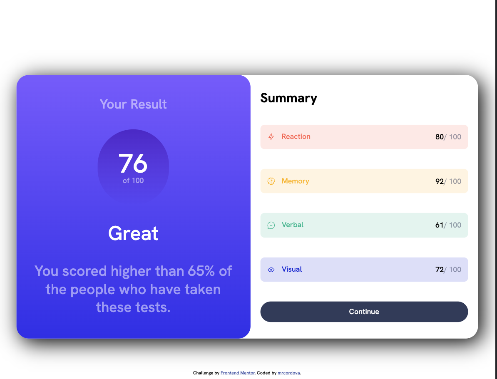

# Frontend Mentor - Results summary component solution

This is a solution to the [Results summary component challenge on Frontend Mentor](https://www.frontendmentor.io/challenges/results-summary-component-CE_K6s0maV). Frontend Mentor challenges help you improve your coding skills by building realistic projects.

## Table of contents

- [Overview](#overview)
  - [The challenge](#the-challenge)
  - [Screenshot](#screenshot)
  - [Links](#links)
- [My process](#my-process)
  - [Built with](#built-with)
  - [What I learned](#what-i-learned)
  - [Continued development](#continued-development)
  - [Useful resources](#useful-resources)
- [Author](#author)

## Overview

### The challenge

Users should be able to:

- View the optimal layout for the interface depending on their device's screen size
- See hover and focus states for all interactive elements on the page
- **Bonus**: Use the local JSON data to dynamically populate the content

### Screenshot

### Links

- Solution URL: [Add solution URL here](https://your-solution-url.com)
- Live Site URL: [Add live site URL here](https://your-live-site-url.com)

## My process

### Built with

- Semantic HTML5 markup
- CSS custom properties
- Flexbox
- CSS Grid

### What I learned

How to use linear-gradients.

### Continued development

I will focus on CSS grid and responsive layouts.

### Useful resources

- [How to center elements](https://www.freecodecamp.org/news/css-vertical-align-how-to-center-a-div-text-or-an-image-example-code/) - This helped me for XYZ reason. I really liked this pattern and will use it going forward.
- [CSS gradients](https://www.w3schools.com/css/css3_gradients.asp) - How gradients work.

## Author

- Website - [mrcordova](https://github.com/mrcordova?tab=repositories)
- Frontend Mentor - [@mrcordova](https://www.frontendmentor.io/profile/mrcordova)
